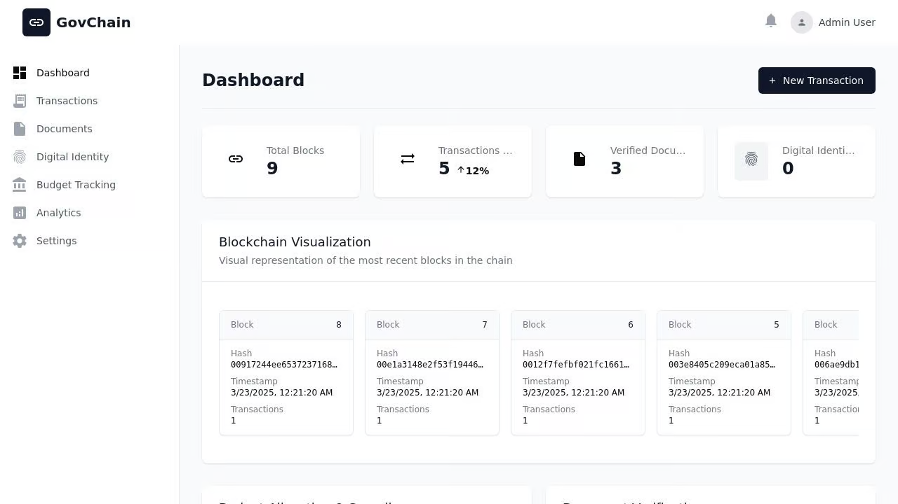

# GovChain - Blockchain Transparency Platform

GovChain is a government transparency blockchain application designed to improve accountability, reduce corruption, and enhance trust in public institutions. It provides secure, tamper-proof record-keeping for government transactions, documents, and budgets.



## Features

### 🔍 Blockchain Explorer
- View real-time blockchain data including blocks, transactions, and network status
- Verify document authenticity and digital identity credentials
- Track the entire history of government transactions with immutable audit trails

### 📊 Budget Transparency
- Monitor government spending across departments
- Track budget utilization with visual representations
- Compare allocated vs. spent funds with detailed breakdowns

### 📄 Document Verification
- Upload and verify official government documents
- Ensure document authenticity through blockchain verification
- Maintain a permanent, immutable record of verified documents

### 👤 Digital Identity Management
- Create and manage secure digital identities for officials and citizens
- Verify identity credentials using blockchain verification
- Revoke compromised identities when necessary

### 💸 Transaction Tracking
- Record and track all government financial transactions
- Categorize transactions by department and purpose
- Ensure all transactions are properly documented and auditable

## Technology Stack

- **Frontend**: React, TypeScript, TailwindCSS
- **Backend**: Node.js, Express
- **Blockchain**: Custom implementation with proof-of-work consensus
- **Data Storage**: In-memory data store (can be upgraded to persistent database)

## Security Features

- SHA-256 cryptographic hashing for all blockchain data
- Digital signatures for identity verification
- Tamper-evident design for all stored records
- Immutable audit trail for all transactions and documents

## Getting Started

### Prerequisites
- Node.js (v16 or higher)
- npm or yarn

### Installation

1. Clone the repository
```
git clone https://github.com/your-organization/govchain.git
cd govchain
```

2. Install dependencies
```
npm install
```

3. Start the development server
```
npm run dev
```

4. Open your browser and navigate to `http://localhost:5000`

## Usage Guide

### Dashboard
The main dashboard provides an overview of key statistics, recent transactions, and system health.

### Blockchain Explorer
Navigate to the Explorer section to view detailed information about blocks, transactions, and network status.

### Document Verification
1. Go to the Documents section
2. Upload a document or enter a document hash to verify
3. View verification status and blockchain receipt

### Digital Identity
1. Navigate to the Digital Identity section
2. Create new identities or manage existing ones
3. Verify identity credentials using the blockchain

### Budget Tracking
The Budget section provides visualizations and detailed breakdowns of government spending.

## API Documentation

GovChain provides a comprehensive API for integration with other government systems:

- `GET /api/stats` - Get system statistics
- `GET /api/blocks` - List blockchain blocks
- `GET /api/transactions` - List transactions
- `GET /api/documents` - List verified documents
- `POST /api/documents/verify` - Verify document authenticity
- `GET /api/budget` - Get budget information
- `GET /api/digital-identities` - List digital identities

## Contributing

Contributions are welcome! Please feel free to submit a Pull Request.

## License

This project is licensed under the MIT License - see the LICENSE file for details.

## Acknowledgements

- Indonesian Ministry of Finance
- Blockchain Technology Working Group
- Corruption Eradication Commission